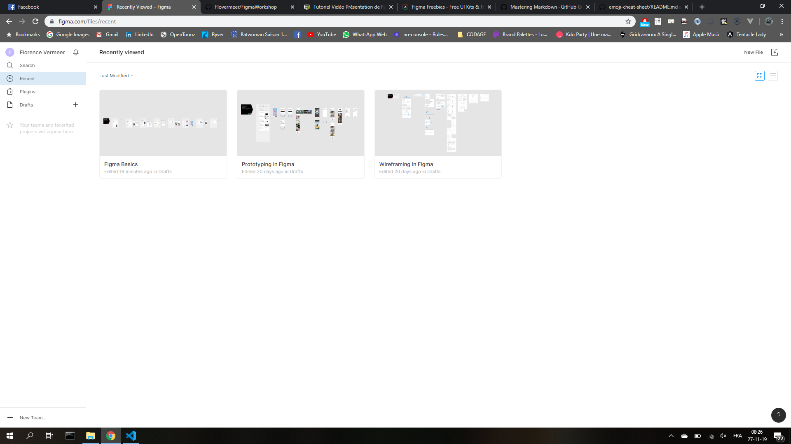
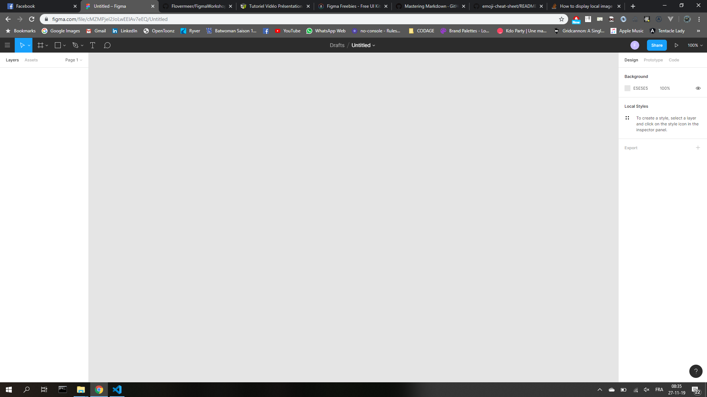
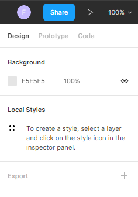
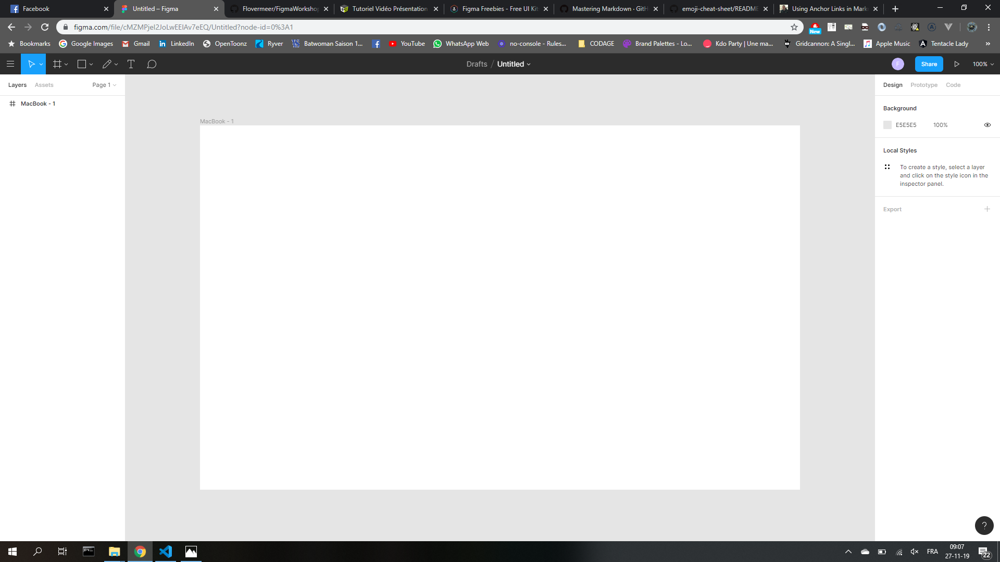
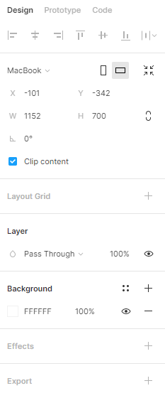
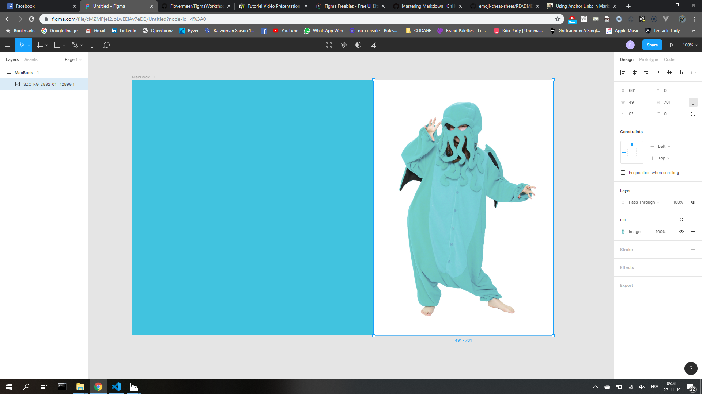
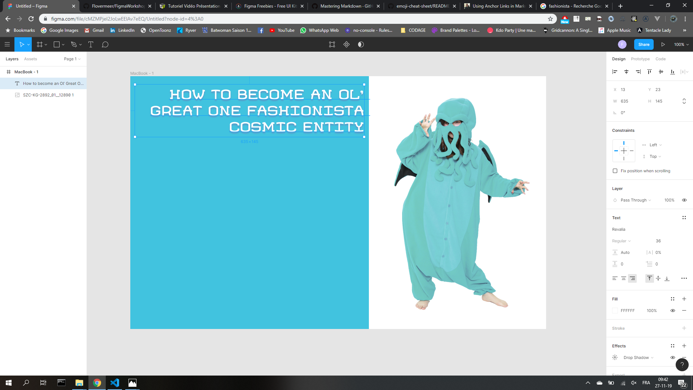

# FIGMA

**Figma, qu'est-ce que c'est ?**  
C'est une application qui permet de créer des interfaces d'applications web & mobiles. Elle permet de réaliser des prototypages montrant aux clients et/ou développeurs les différentes interactions possibles avec votre produit.

**PRO's**

- Figma est disponible entièrement en ligne : pas besoin d'installation,tout se fait depuis le browser.
- On peut travailler à plusieurs ET simultanément sur le même projet.
- Il est également possible de partager des styles, des palettes et des composants au sein d'une même équipe.

**CON's**

- Vous êtes cuits s'il n'y a pas de réseau.:clown_face:
- A terme, il vous faudra un abonnement (contrairement à Adobe XD)

**Tarifs**  
**Starter** : Free  
**Pro** : 12$/éditeur/mois  
    **Organisation** : 45$/éditeur/mois  
[Les offres](https://www.figma.com/pricing/)

## Se créer un compte

Rien de bien compliqué, il suffit de se rendre [ici](https://www.figma.com/).  
De cliquer sur **SIGN UP** (en haut à droite, oui là, le gros bouton noir) et de remplir le formulaire.  
Vous arriverez sur votre dashboard, qui ressemble à ceci :  

Il y a de base 3 "tuto" pour vous expliquer les bases de Figma.

- Figma Basics : l'interface.
- Prototyping in Figma : le prototypage.
- Wireframing in Figma : vous trouverez bien tous seuls !

**Créer un projet**  
Dans le menu de gauche, cliquez sur le " + " à côté de "Drafts".  
Vous arrivez sur cette page :

## L'interface d'un projet

**Barre du haut**  
  
Dans l'ordre, de gauche à droite :

- **Menu Burger** : Toutes les interactions que vous pourrez faire sont résumées ici, ainsi que la gestion de fichier.
- **La flèche / Move** : Sélectionner, déplacer...
- **La grille / Frame** : Création d'une nouvelle vue. A droite, vous pouvez choisir pour quel type d'appareil est destinée votre appli (Iphone, Ipad, Desktop...)
- **Le carré / Rectangle** : Pour dessiner les éléments (formes, lignes, ajout d'images...)
- **La plume / Pen** : Pour faire des gribouillages partout, en vectoriel ou à main levée...
- **Texte** : Je vous laisse deviner...
- **La bubulle** : Pour rajouter ou afficher/cacher les commentaires. Toujours pratique !

**Menu de droite**  

- **Design** : la partie où vous créerez votre projet (ajout de page, de différents éléments, de texte...)
- **Prototype** : Ici, vous créerez les relations entre les différents parties de votre projet.
- **Code** : Vous reprendrez bien un peu de CSS ?

Le bouton **PLAY** vous permet de tester votre appli en "conditions réelles".

## Petit échauffement

Pour commencer, histoire de prendre ses marques, on va se créer une page avec quelques éléments :

- un titre
- une image
- une couleur de fond
- un élément en plus de votre choix

### First step :

On clique sur **Frame** et on choisit un type d'appareil (Desktop > MacBook)  

Le menu de droite vous permet de configurer l'élément nouvellement créé. Le menu n'apparaît que si on sélectionne l'élément.  

Commençons par changer la couleur de fond. **ASTUCE** : Background :scream:

### Ajout d'une image :

Si vous avez bien lu tout le blabla plus haut, vous devriez avoir une petite idée d'où aller chercher votre image...

Non ? Vous êtes de ceux qui ne lisent pas la doc... Allez, je suis sympa : **c'est en haut et c'est carré**.  
Sinon, le drag & drop fonctionne bien aussi.  
A **droite**, toujours pareil, les réglages de l'élement. A **gauche**, dans l'onglet **Layers**, votre image apparaît.  

Lorsque vous aurez placé votre image, vous aurez la possibilité de la redimensionner. Pour garder le ratio hauteur/largeur, maintenez **SHIFT** enfoncé.

### Titre !

M'est d'avis que vous savez quoi faire...

Dans le menu de droite, vous trouverez un moyen de rajouter des **effets**. Vous remarquerez aussi que votre texte s'est rajouté dans le menu de gauche.  
Une arborescence s'est créée et contient tout ce qu'il y a dans votre "vue" Mac-Book. Figma fonctionne par "pages".

### L'élément bonus

Je vous laisse vous débrouiller, vous êtes grands maintenant !
