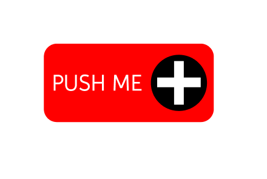
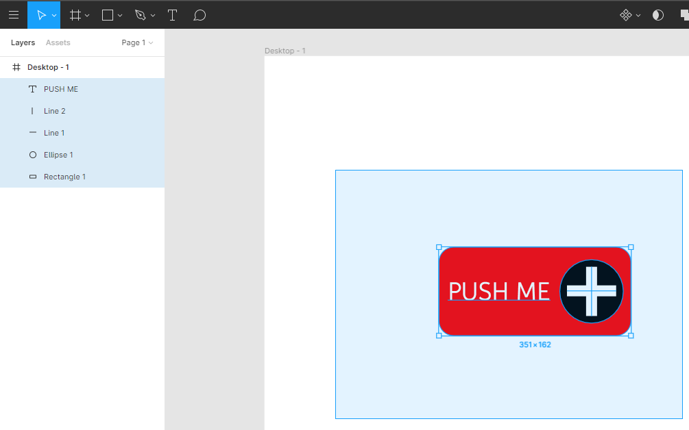
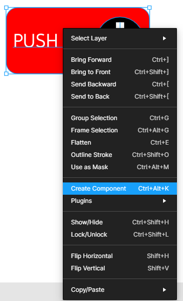
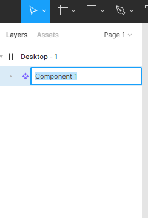
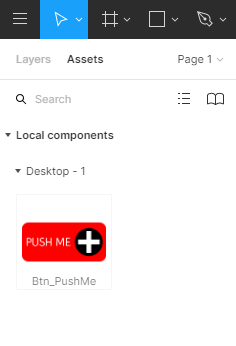
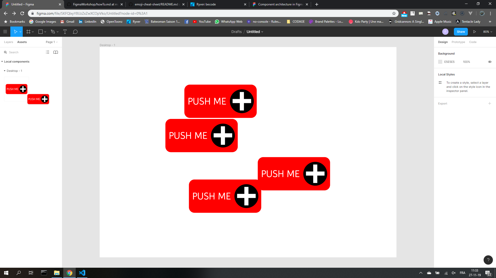
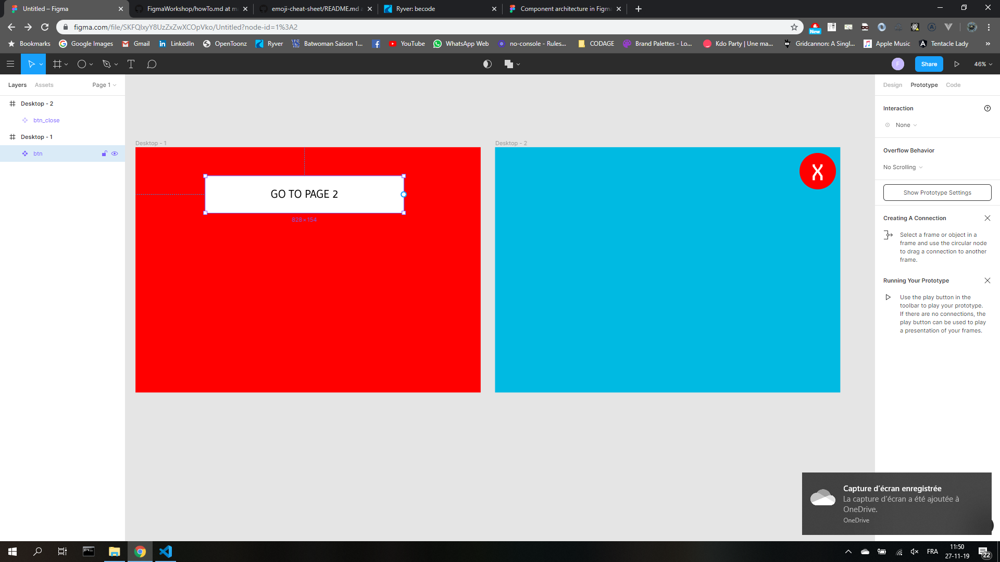
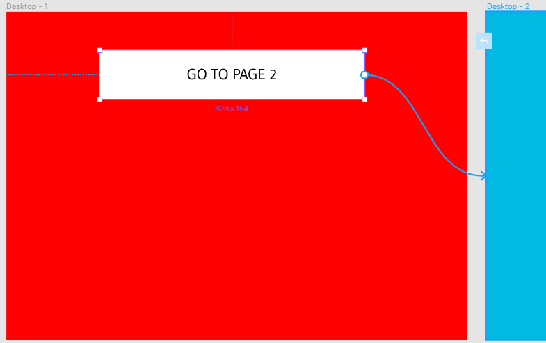
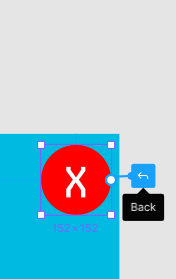

### Table des matières

- [Premiers pas](./README.md)
- [User Stories](./UserStories.md)
- How to : c'est ici !

# How To

Comment qu'on fait ça ? Input ? WTF ? :sob: :sob: :sob:

## Components

FIGMA permet de créer des composants (do you speak MVC ?). Pour ce faire, rien de plus simple !

### Créez ce qui vous servira de component (un bouton par exemple) :

### Sélectionnez tous les élements qui le compose

### Click droit dessus et choisissez "Create Component"

### Dans le menu de gauche, dans Assets, votre component apparaît.

Vous pouvez le renommer et le drag & drop !  
  
  

## Créer le prototype : linker les pages entre elles

Le mode prototype de FIGMA permet de créer la logique de votre app. Et c'est ultra simple !

### Premièrement, il faut créer plusieurs pages :

Il faut également aller dans l'onglet Prototype du menu de droite:

### Vous sélectionnez l'élément qui linkera vers une autre page. Un petit rond va apparaître.

Il faut le drag&drop vers la page que vous souhaitez.

### Vous pouvez également linker vers un "back", ou retour arrière.

